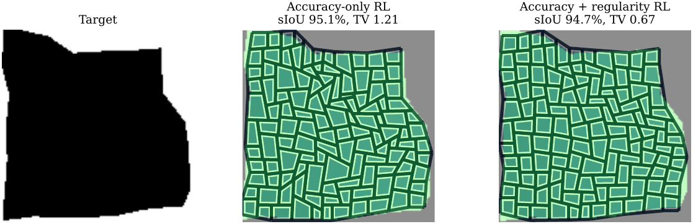
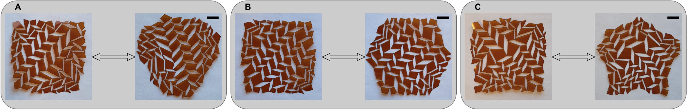

# RL-Kirigami

Inverse design for compact reconfigurable parallelogram quad kirigami. An OT-CFM generator proposes ratio fields conditioned on a target deployed silhouette; GRPO then aligns the generator to non-differentiable rewards (silhouette match, feasibility, ratio-field regularity). Decoded layouts are laser-cut into deployable polyamide prototypes.

<p align="center">
  
</p>

## Highlights

- **1 forward evaluation per target** vs. 625–1000 for solver baselines
- **94.2% sIoU** with a single OT-CFM sample; **94.91%** after GRPO accuracy fine-tuning
- **TV(x) 0.95 → 0.81** with combined accuracy + regularity reward, sIoU preserved at 94.83%
- **Rapid laser-cut prototyping** in 8 ± 1 min per 50 µm polyamide part

## Key results

Silhouette matching on the full test split (values are mean over 3 seeds).

| Method | sIoU ↑ (%) | p_succ ↑ (%) | # F ↓ |
|---|---:|---:|---:|
| CMA-ES | 93.8 | 97.0 | 986 |
| Particle swarm | 92.6 | 97.2 | 625 |
| Random-restart local search | 91.2 | 89.8 | 1000 |
| Bounded Powell (Dudte-style) | 87.1 | 76.0 | 1000 |
| **OT-CFM (ours)** | **94.2** | **98.7** | **1** |

GRPO preference alignment (10 000 environment calls, Euler-8 sampling).

| Variant | sIoU ↑ (%) | TV(x) ↓ |
|---|---:|---:|
| OT-CFM prior | 94.2 | 0.95 |
| GRPO — accuracy | **94.91** | 0.98 |
| GRPO — regularity | 93.67 | **0.60** |
| GRPO — accuracy + regularity | 94.83 | 0.81 |

<p align="center">
  
</p>

## Prototypes

<p align="center">
  
</p>

Laser-cut 50 µm polyamide prototypes for heart, hexagon, and star targets — compact state (left) and deployed state (right). Scale bars: 1 cm.

## Quickstart

```bash
pip install -e .   # optional: CLI wrappers from pyproject.toml
```

**1. Generate the dataset**

```bash
python -m data_generator.generator --config configs/data_generator.yaml
```

Outputs: `data_generator/kirigami_x_dataset.pkl`, `data_generator/preview.png`, `data_generator/gifs/`.
Prebuilt 5000 / 500 / 500 split: [Google Drive](https://drive.google.com/file/d/1axPzf4ZQqxoUYIf5aEJaMD0E0eLZGRXG/view?usp=sharing).

**2. Train the OT-CFM prior**

```bash
python fm_training.py --config_path configs/training.yaml --resume last
```

Checkpoints → `checkpoints/<run_name>/`, TensorBoard → `checkpoints/tb/`.

**3. RL fine-tune with GRPO**

```bash
python rl_training.py --config_path configs/training.yaml --init_from last --resume last
```

`--init_from last` loads the latest OT-CFM checkpoint. RL checkpoints land in `checkpoints/<run_name>_RL/`.

## Configuration

| File / block | What it controls |
|---|---|
| `configs/data_generator.yaml` | grid size, mask resolution, split sizes, x range, sampler, seed |
| `configs/training.yaml` → `model_config` | backbone and tensor shapes |
| `configs/training.yaml` → `training` | shared training settings (optimizer, batches, epochs) |
| `configs/training.yaml` → `rl_training` | GRPO-only overrides (group size, reward weights, temperature) |

Keep the two configs consistent — `training.yaml` reads `grid_rows/cols`, `x_min/max`, and mask size from `data_generator.yaml`. If the dataset pickle is not at the default path, set `data.pickle_path`.
