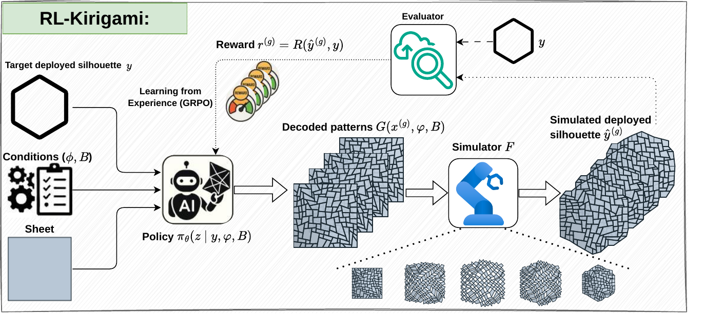

# RL-Kirigami

Inverse design for compact reconfigurable parallelogram quad kirigami. An OT-CFM generator proposes ratio fields conditioned on a target deployed silhouette; GRPO then aligns the generator to non-differentiable rewards (silhouette match, feasibility, ratio-field regularity). Decoded layouts can be exported as DXF for laser cutting.

<p align="center">
  
</p>

## Setup

```bash
pip install -e .   # optional: installs the CLI wrappers declared in pyproject.toml
```

The three entry points below can also be invoked directly as `python <script>.py`.

## 1. Generate the dataset

```bash
python -m data_generator.generator --config configs/data_generator.yaml
```

Outputs:

- `data_generator/kirigami_x_dataset.pkl` - dataset pickle
- `data_generator/preview.png` - sample grid
- `data_generator/gifs/` - per-sample deployment animations

A prebuilt 5000 / 500 / 500 split is available on [Google Drive](https://drive.google.com/file/d/1axPzf4ZQqxoUYIf5aEJaMD0E0eLZGRXG/view?usp=sharing). If the pickle is not at the default path, set `data.pickle_path` in `configs/training.yaml`.

## 2. Train the OT-CFM prior

```bash
python fm_training.py --config_path configs/training.yaml --resume last
```

Outputs:

- `checkpoints/<run_name>/` - checkpoints
- `checkpoints/tb/` - TensorBoard logs

Use `--resume last` to continue from the most recent checkpoint, or omit it to start fresh.

## 3. RL fine-tune with GRPO

```bash
python rl_training.py --config_path configs/training.yaml --init_from last --resume last
```

`--init_from last` loads the latest OT-CFM checkpoint as the starting policy. RL checkpoints are written to `checkpoints/<run_name>_RL/`.

## Configuration

| File / block | What it controls |
|---|---|
| `configs/data_generator.yaml` | grid size, mask resolution, split sizes, x range, sampler, seed |
| `configs/training.yaml` -> `model_config` | backbone and tensor shapes |
| `configs/training.yaml` -> `data` | dataset and generator references |
| `configs/training.yaml` -> `training` | shared training settings (optimizer, batches, epochs) |
| `configs/training.yaml` -> `rl_training` | GRPO-only overrides (group size, reward weights, temperature) |

Keep the two YAML files consistent: `training.yaml` reads `grid_rows`, `grid_cols`, `x_min`, `x_max`, and the mask size from `data_generator.yaml`.
