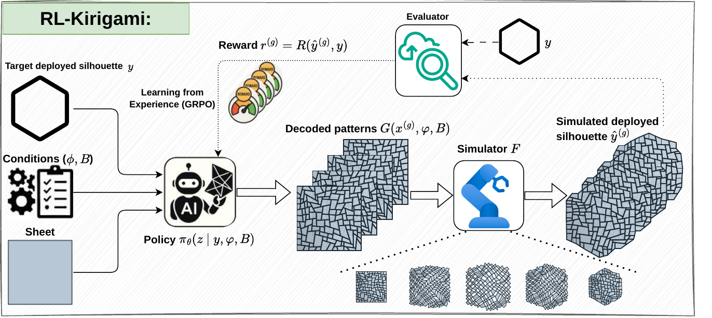

<div align="center">

# RL-Kirigami

**Reinforcement learning for inverse silhouette design of compact, reconfigurable quad kirigami**

<p>
  <a href="https://doi.org/10.1016/j.matdes.2026.116545"></a>
  <a href="https://doi.org/10.1016/j.matdes.2026.116545"></a>
  <a href="pyproject.toml"></a>
  <a href="pyproject.toml"></a>
</p>

Research code accompanying our 2026 *Materials & Design* paper.

[Paper](https://doi.org/10.1016/j.matdes.2026.116545) | [Installation](#installation) | [Citation](#citation)

</div>

---

## Overview

RL-Kirigami is an inverse-design framework for compact reconfigurable parallelogram quad kirigami. Given a target deployed silhouette, the framework:

- uses **optimal-transport conditional flow matching (OT-CFM)** to generate candidate ratio fields;
- applies a marching decoder to enforce globally compatible kirigami geometry;
- fine-tunes the generator with **Group Relative Policy Optimization (GRPO)**-style using non-differentiable rewards for silhouette agreement, feasibility, and ratio-field regularity; and
- supports a rapid fabrication workflow for laser-cut kirigami prototypes.

<p align="center">
  
  <br>
  <sub>RL-Kirigami pipeline: target silhouette, conditional generation, geometric decoding, and fabrication.</sub>
</p>

## Publication

> [!IMPORTANT]
> The accompanying paper is **available online** in *Materials & Design* as of 2 July 2026:
>
> **"Reinforcement learning for inverse silhouette design and rapid laser cutting of compact parallelogram quad kirigami prototypes"**<br>
> Milad Yazdani, Shahriar Shalileh, and Dena Shahriari<br>
> *Materials & Design* (2026), Article 116545 | [https://doi.org/10.1016/j.matdes.2026.116545](https://doi.org/10.1016/j.matdes.2026.116545)

If this repository or the associated methodology contributes to your work, we would be grateful if you cite the paper using the entry in the [Citation](#citation) section.

## Installation

RL-Kirigami requires Python 3.9-3.12. The default training configuration uses one GPU with bfloat16 mixed precision.

```bash
git clone https://github.com/milad1378yz/RL-Kirigami.git
cd RL-Kirigami

conda create -n rl-kirigami python=3.11
conda activate rl-kirigami
python -m pip install -e .
```

The editable install provides these command-line entry points:

| Task | Command |
|---|---|
| Generate a dataset | `rl-kirigami-generate` |
| Train the OT-CFM prior | `rl-kirigami-train-fm` |
| Fine-tune with GRPO | `rl-kirigami-train-rl` |

The scripts can also be invoked directly, as shown below.

## Reproducing the workflow

### 1. Generate the dataset

```bash
python -m data_generator.generator --config configs/data_generator.yaml
```

This creates:

- `data_generator/kirigami_x_dataset.pkl` - training, validation, and test splits;
- `data_generator/preview.png` - a preview grid; and
- `data_generator/gifs/` - sample deployment animations.

To use a dataset generated at a different location, update the appropriate stage-specific path (`fm_data.pickle_path` or `rl_data.pickle_path`) in `configs/training.yaml`.

### 2. Train the OT-CFM prior

```bash
python fm_training.py --config_path configs/training.yaml
```

Training artifacts are written to:

- `checkpoints/<run_name>/` - model checkpoints and validation artifacts; and
- `checkpoints/tb/<run_name>/` - TensorBoard logs.

If a checkpoint already exists for the run, training resumes automatically from the most recent checkpoint.

### 3. Fine-tune with GRPO

```bash
python rl_training.py --config_path configs/training.yaml --init_from last
```

On a new RL run, `--init_from last` initializes the policy from the latest OT-CFM checkpoint. If an RL checkpoint already exists, training resumes from it automatically. RL outputs are stored in `checkpoints/<run_name>_RL/`.

## Configuration

| File or section | Purpose |
|---|---|
| `configs/data_generator.yaml` | Grid dimensions, mask resolution, split sizes, ratio range, sampling strategy, filters, and seed |
| `configs/training.yaml` -> `model_config` | Neural-network architecture and tensor dimensions |
| `configs/training.yaml` -> `data` | Generator configuration and shared split names |
| `configs/training.yaml` -> `fm_data` / `rl_data` | Stage-specific dataset paths |
| `configs/training.yaml` -> `common_training` | Hardware, precision, solver, checkpoint, and logging settings shared by both stages |
| `configs/training.yaml` -> `fm_training` | OT-CFM optimization, augmentation, validation, and batch settings |
| `configs/training.yaml` -> `rl_training` | GRPO group size, reward shaping, regularization, and training settings |

The training pipeline reads the grid geometry, ratio bounds, and mask resolution from `configs/data_generator.yaml`. Keep that file consistent with the dataset used for training.

## Repository structure

```text
RL-Kirigami/
|-- assets/                 # README figures
|-- configs/                # Dataset-generation and training configurations
|-- data_generator/         # Geometry, dataset generation, and visualization
|-- kirigami_training/      # Models, data loading, metrics, rewards, and sampling
|-- fm_training.py          # OT-CFM training entry point
|-- rl_training.py          # GRPO fine-tuning entry point
|-- distill_training.py     # Optional target-distillation workflow
`-- pyproject.toml          # Package metadata and dependencies
```

## Citation

If RL-Kirigami supports your research, please cite the accompanying publication:

```bibtex
@article{yazdani2026reinforcement,
  title={Reinforcement learning for inverse silhouette design and rapid laser cutting of compact parallelogram quad kirigami prototypes},
  author={Yazdani, Milad and Shalileh, Shahriar and Shahriari, Dena},
  journal={Materials \& Design},
  pages={116545},
  year={2026},
  publisher={Elsevier}
}
```
